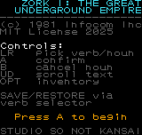
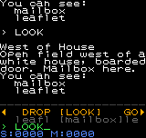

# Zork Neo

**Zork I: The Great Underground Empire** for the Neo Geo Pocket Color.

A port of the classic 1981 Infocom text adventure, adapted for the NGPC's
20×19 character display with a button-driven verb/noun parser — no keyboard required.




## Controls

| Button | Action |
|--------|--------|
| Left/Right | Cycle verb (when verb row active) or noun (when noun row active) — single tap, no auto-repeat |
| A | Confirm verb → move to noun selection; confirm noun → execute command |
| B | Cancel noun selection, return to verb |
| Up/Down | Scroll text output history — hold to auto-repeat |
| Option | Quick inventory |

The **amber** row is the active selector. Press A to confirm your verb, then
the row turns **green** for noun selection. Every command you confirm is
echoed into the scroll buffer (`> TAKE lamp`) so the session reads like a
real Zork transcript.

`GO` is a directional verb — press A on `GO` and the noun row only shows
exits that actually exist from your current room. `ENTER` is context-sensitive
and needs no noun at all (e.g. entering the kitchen window from Behind House).

## Gameplay

You are an adventurer exploring the Great Underground Empire. Collect
treasures and deposit them in the trophy case in the Living Room to score
points. Watch your lamp — it has limited battery life, and most underground
rooms are pitch black without it (you'll be warned about grues).

Start at West of House. Open the mailbox. Read the leaflet. Find your way
inside through the window behind the house. A troll guards the way further
underground — you'll need a weapon (sword, knife, or screwdriver) to get past him.

`SAVE` and `RESTORE` are available as verbs from the verb selector. **Note:**
flash save/load is not yet confirmed working under Mednafen (a known emulator
limitation also seen with other carts in this devkit) — use Mednafen's own
save-state feature (F5/F7 or your bound keys) for iterative testing in the
meantime. Flash persistence is expected to work correctly on real hardware.

## Debug / testing tools

**Wizard mode** — enter the Konami code (↑↑↓↓←→←→BA) on the joypad to toggle:
- All rooms lit regardless of lamp state
- `OPTION` + `Up`/`Down` teleports to the previous/next room by ID
- `OPTION` + `A` dumps the command transcript to a second flash slot
- `OPTION` + `B` auto-plays a scripted checkpoint sequence (one command/second)
- Status bar turns red and shows the current room ID, score, and moves

**Transcript extraction** — after `OPTION+A` in wizard mode:
```bash
make transcript
# or directly:
python3 tools/read_transcript.py ~/.mednafen/sav/zork-neo.ngp.flash
```
This pulls the logged command sequence out of the flash file for review.

## Build

Requires the NGPC devkit (cc900/tulink/tuconv/s242ngp) and the ameliandev
ngpc-project-template framework.

```bash
./bootstrap.sh          # copy common files from devkit
make                    # build
make run                # run in Mednafen
make test                # build + print wizard-mode testing instructions
```

## Status

Checkpoint 1 of the published Zork I walkthrough is playable end-to-end:
West of House → mailbox/leaflet → behind house → kitchen → living room →
lamp, sword, rug, trap door → cellar → troll combat. Diagonal directions
(NE/SE/NW/SW) and the rooms beyond the troll are not yet implemented.

## Credits

Game content derived from **Zork I: The Great Underground Empire**
© 1981, 1982, 1983 Infocom, Inc.
Released as open source under the MIT License by Microsoft/Activision, November 2025.

NGPC port by **underscore42** / Studio So Not Kansai, 2025.

Engine, parser, text system, and UI written from scratch for the TLCS-900H.

## License

The NGPC port code (engine, parser, text system, UI) is released under the MIT License.
See [LICENSE](LICENSE) for details.

Zork I game content is used under the MIT License granted by Microsoft/Activision (November 2025).
See [LICENSE-ZORK](LICENSE-ZORK) for the original Zork license.
